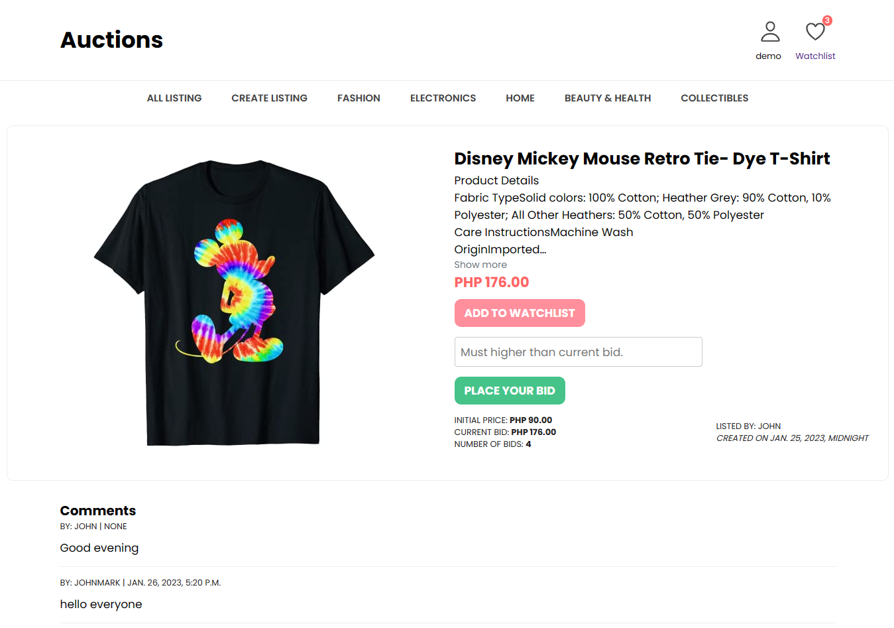

# Auctions
E-commerce auction site that will allow users to post auction listings, place bids on listings, comment on those listings, and add listings to a watchlist.

## Summary

The aim of this project was to build an eBay-like e-commerce auction site using the Python Django framework. Users can post auction listings, place bids on the listings, comment on those listings, and add listings to a “watchlist.”

[View the full assignment description on CS50's OpenCourseWare](https://cs50.harvard.edu/web/2020/projects/2/commerce/)

## Technologies
* Python Django
* Javascript
* HTML
* CSS
* SQLite3

## Implementation.

### Models
This application have four models in addition to the `User` model: `Listing` for the auction listings, `Bid` for the bids made by the user on the listing, `Category` for the categories available to categorize the listing upon its creation, and `Comments` for comments made on auction listings.

### Create Listing
Users can be able to visit a page to create a new listing. They can be able to specify a title for the listing, a text-based description, and what the starting bid should be. Users can also optionally be able to provide a URL for an image for the listing and/or a category.

### Active Listings Page
For each active listing, this page displays the title, description, current price, and photo (if one exists for the listing).

### Listing Page
Clicking on a listing takes the users to a page specific to that listing. On that page, users can be able to view all details about the listing, including the current price for the listing.
* If the user is signed in, the user is able to add the item to their “Watchlist.” If the item is already on the watchlist, the user is able to remove it.
* If the user is signed in, the user can be able to bid on the item. The bid must be at least as large as the starting bid, and must be greater than any other bids that have been placed (if any). If the bid doesn’t meet those criteria, the user would be presented with an error.
* If the user is signed in and is the one who created the listing, the user have the ability to “close” the auction from this page, which makes the highest bidder the winner of the auction and makes the listing no longer active.
* If a user is signed in on a closed listing page, and the user has won that auction, the page should say so.
* Users who are signed in can be able to add comments to the listing page. The listing page displays all comments that have been made on the listing.

### Watchlist
Users who are signed in can be able to visit a Watchlist page, which displays all of the listings that a user has added to their watchlist. Clicking on any of those listings takes the user to that listing’s page.

### Categories
Users can be able to visit a page that displays a list of all listing categories. Clicking on the name of any category takes the user to a page that displays all of the active listings in that category.

## How to Run
1. Clone this repository, navigate to the project and type the following commands:
2. Install requirements (Django): `pip install -r requirements.txt`
3. Run the app locally: `python manage.py runserver`